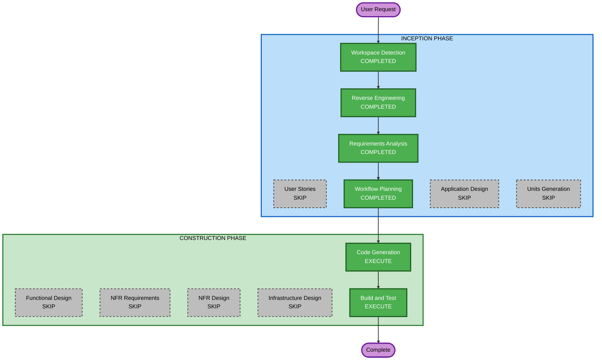

# Execution Plan

## Detailed Analysis Summary

### Transformation Scope
- **Transformation Type**: Multiple component addition (バックアップスクリプト拡張 + ビューア機能追加)
- **Primary Changes**: Wiki/ドキュメントのバックアップ・表示機能追加
- **Related Components**: scripts/backlog, viewer (stores, containers, components, routing)

### Change Impact Assessment
- **User-facing changes**: Yes — タブナビゲーション追加、Wiki/ドキュメント一覧・詳細ページ追加
- **Structural changes**: Yes — 新規ストア追加、ルーティング拡張、新規コンテナ追加
- **Data model changes**: Yes — Document型定義追加（backlog-jsに未定義）、ローカルJSONストレージ構造追加
- **API changes**: Yes — Document API直接呼び出し追加（backlog-js未対応）
- **NFR impact**: No — 既存パターン準拠、読み取り専用

### Component Relationships
```
scripts/backlog (バックアップスクリプト)
  ├── 変更: Wiki/ドキュメントバックアップ処理追加
  └── 依存: backlog-js (Wiki API), fetch (Document API)

viewer/stores
  ├── 追加: WikiStore, DocumentStore
  └── 変更: RootStore (新ストア登録)

viewer/containers
  ├── 変更: issues.tsx → タブナビゲーション追加
  ├── 追加: wikis.tsx (Wiki一覧)
  ├── 追加: wiki.tsx (Wiki詳細)
  ├── 追加: documents.tsx (ドキュメント一覧+ツリー)
  └── 追加: document.tsx (ドキュメント詳細)

viewer/index.tsx
  └── 変更: ルート追加 (/wikis, /wikis/:id, /documents, /documents/:id)
```

### Risk Assessment
- **Risk Level**: Medium
- **Rollback Complexity**: Easy (新規ファイル追加が主、既存ファイルの変更は最小限)
- **Testing Complexity**: Moderate (2つの描画エンジン、Document API直接呼び出し)

## Workflow Visualization



### Text Alternative
```
Phase 1: INCEPTION
- Workspace Detection (COMPLETED)
- Reverse Engineering (COMPLETED)
- Requirements Analysis (COMPLETED)
- User Stories (SKIP)
- Workflow Planning (COMPLETED)
- Application Design (SKIP)
- Units Generation (SKIP)

Phase 2: CONSTRUCTION
- Functional Design (SKIP)
- NFR Requirements (SKIP)
- NFR Design (SKIP)
- Infrastructure Design (SKIP)
- Code Generation (EXECUTE)
- Build and Test (EXECUTE)
```

## Phases to Execute

### INCEPTION PHASE
- [x] Workspace Detection (COMPLETED)
- [x] Reverse Engineering (COMPLETED)
- [x] Requirements Analysis (COMPLETED)
- [x] User Stories (SKIP)
  - **Rationale**: 単一ユーザータイプ（閲覧者）、明確な機能要件、ユーザーストーリーの付加価値が低い
- [x] Workflow Planning (COMPLETED)
- [ ] Application Design (SKIP)
  - **Rationale**: 既存アーキテクチャパターン（MobX Store + Container）に準拠、新規コンポーネント設計は要件で十分定義済み
- [ ] Units Generation (SKIP)
  - **Rationale**: 単一ユニットとして実装可能（Wiki+ドキュメント機能は密結合）

### CONSTRUCTION PHASE
- [ ] Functional Design (SKIP)
  - **Rationale**: ビジネスロジックが単純（CRUD読み取りのみ）、要件で十分定義済み
- [ ] NFR Requirements (SKIP)
  - **Rationale**: 既存NFRパターンに準拠、新規NFR要件なし
- [ ] NFR Design (SKIP)
  - **Rationale**: NFR Requirementsをスキップのため
- [ ] Infrastructure Design (SKIP)
  - **Rationale**: インフラ変更なし（ローカル静的ファイル配信のまま）
- [ ] Code Generation - **EXECUTE**
  - **Rationale**: 実装計画策定とコード生成が必要
- [ ] Build and Test - **EXECUTE**
  - **Rationale**: ビルド確認と動作検証が必要

## Package Change Sequence
1. **scripts/backlog** — バックアップスクリプト拡張（Wiki + Document API呼び出し追加）
2. **viewer/stores** — WikiStore, DocumentStore追加、RootStore更新
3. **viewer/containers** — Wiki/ドキュメント一覧・詳細ページ追加、タブナビゲーション
4. **viewer/index.tsx** — ルーティング追加
5. **package.json** — Tiptap依存関係追加

## Success Criteria
- **Primary Goal**: Wiki・ドキュメントのバックアップと読み取り専用表示
- **Key Deliverables**:
  - Wikiバックアップ・一覧・詳細表示（Markdown/プレーンテキスト描画）
  - ドキュメントバックアップ・ツリー表示・詳細表示（Tiptap読み取り専用描画）
  - タブナビゲーション（課題/Wiki/ドキュメント）
- **Quality Gates**:
  - ビルド成功（vite build）
  - 既存機能への影響なし
