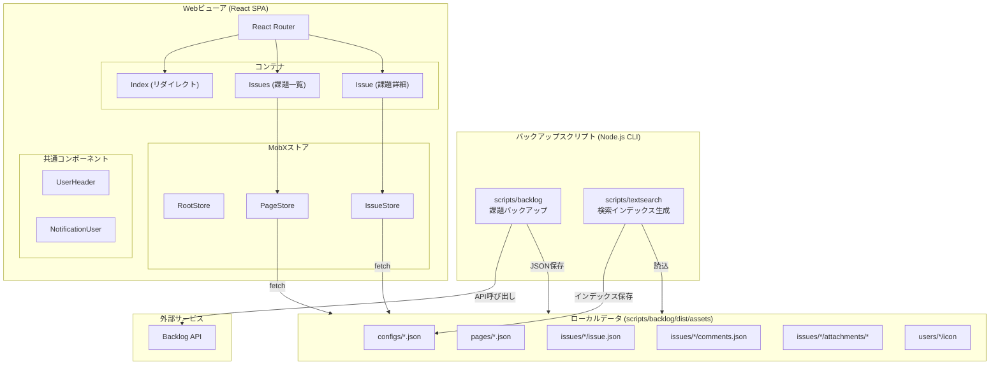
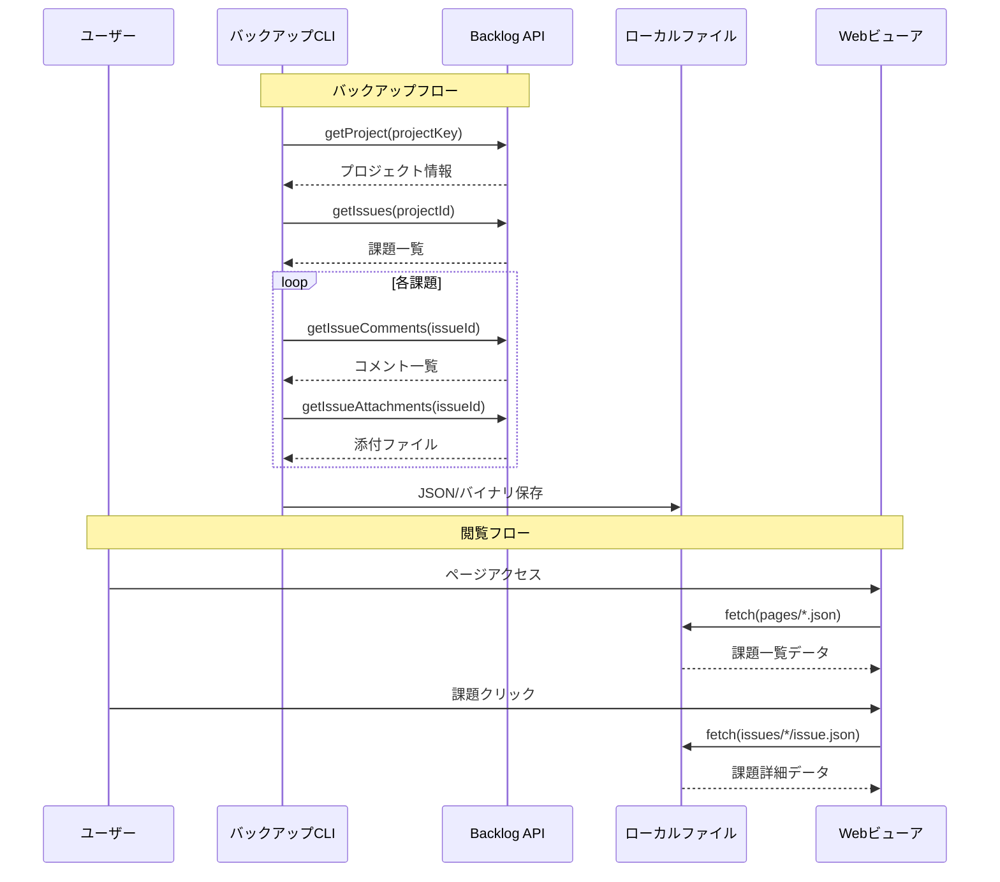

# System Architecture

## System Overview
backlogupは、Backlogプロジェクト管理ツールのデータをローカルにバックアップし、オフラインで閲覧可能なReact SPAビューアを提供するモノリシックアプリケーション。バックアップスクリプト（Node.js CLI）とWebビューア（React SPA）の2つの主要コンポーネントで構成される。

## Architecture Diagram

## Component Descriptions

### scripts/backlog (バックアップスクリプト)
- **Purpose**: Backlog APIからプロジェクトの全データをダウンロード
- **Responsibilities**: 課題、コメント、添付ファイル、ユーザーアイコンの取得と保存
- **Dependencies**: backlog-js, dotenv
- **Type**: Application (CLI)

### scripts/textsearch (検索インデックス生成)
- **Purpose**: 全文検索用インデックスの生成
- **Responsibilities**: Markdown→プレーンテキスト変換、形態素解析、FlexSearchインデックス生成
- **Dependencies**: remark, strip-markdown, kuromojin
- **Type**: Application (CLI)

### viewer (Webビューア)
- **Purpose**: バックアップデータのブラウザ表示
- **Responsibilities**: SPA表示、ルーティング、状態管理、Markdown描画
- **Dependencies**: React, MobX, MUI, react-markdown, react-router-dom
- **Type**: Application (SPA)

## Data Flow

## Integration Points
- **External APIs**: Backlog API v2 (backlog-js経由)
- **Databases**: なし（JSONファイルベース）
- **Third-party Services**: Google Fonts (Noto Sans JP, Quicksand, Inconsolata, Red Hat Display)

## Infrastructure Components
- **CDK Stacks**: なし
- **Deployment Model**: Viteビルド → 静的ファイル配信
- **Networking**: ローカル開発サーバー（Vite dev server）
