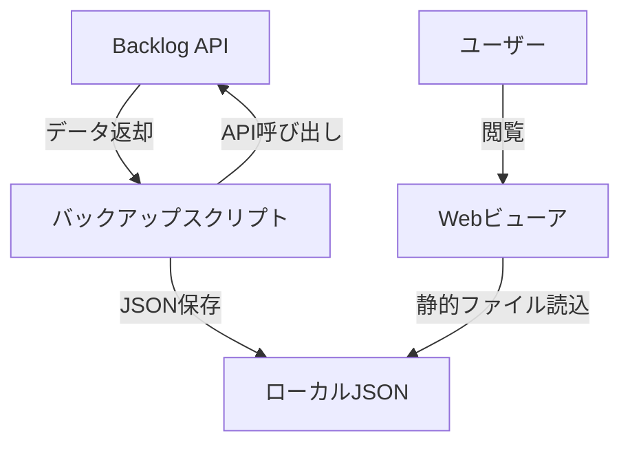

# Business Overview

## Business Context Diagram

## Business Description
- **Business Description**: Backlogプロジェクト管理ツールのデータをローカルにバックアップし、オフラインで閲覧可能なWebビューアを提供するシステム。Backlog APIからプロジェクトの課題、コメント、添付ファイル、ユーザー情報を取得してJSON形式で保存し、React SPAで表示する。
- **Business Transactions**:
  1. **課題バックアップ**: Backlog APIから全課題・コメント・添付ファイルをダウンロードしてローカルJSONに保存
  2. **検索インデックス生成**: 形態素解析（kuromoji）を使用してキーワード検索用インデックスを生成
  3. **課題一覧閲覧**: バックアップされた課題をDataGridで一覧表示（ページネーション・検索対応）
  4. **課題詳細閲覧**: 個別課題の詳細情報・コメント・添付ファイルを表示
- **Business Dictionary**:
  - **課題 (Issue)**: Backlogのタスク管理単位
  - **種別 (IssueType)**: 課題の分類（バグ、タスク等）
  - **マイルストーン (Milestone)**: リリース目標
  - **カテゴリー (Category)**: 課題のグループ分け

## Component Level Business Descriptions

### scripts/backlog (バックアップスクリプト)
- **Purpose**: Backlog APIからプロジェクトデータを取得しローカルに保存
- **Responsibilities**: 課題・コメント・添付ファイル・ユーザーアイコンのダウンロード、JSON形式での保存

### scripts/textsearch (検索インデックス生成)
- **Purpose**: バックアップデータからキーワード検索用インデックスを生成
- **Responsibilities**: Markdownのプレーンテキスト変換、形態素解析、FlexSearch用インデックス生成

### viewer (Webビューア)
- **Purpose**: バックアップされたデータをブラウザで閲覧
- **Responsibilities**: 課題一覧表示、課題詳細表示、コメント表示、キーワード検索、添付ファイル表示
