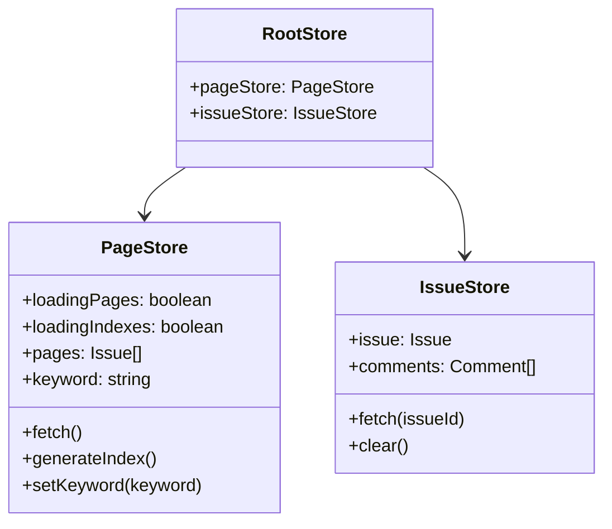

# Code Structure

## Build System
- **Type**: npm + Vite
- **Configuration**:
  - `package.json` - 依存関係・スクリプト定義
  - `vite.config.js` - Viteビルド設定（React, tsconfigPaths, nodePolyfills）
  - `tsconfig.json` - TypeScript設定（target: es2017, jsx: react, strict: true）
  - `rome.json` - Romeリンター設定

## Key Classes/Modules

### Existing Files Inventory

**Viewer (SPA)**
- `viewer/index.html` - HTMLエントリーポイント
- `viewer/index.tsx` - Reactアプリケーションエントリーポイント、ルーティング定義
- `viewer/@types/env.d.ts` - Vite環境変数型定義
- `viewer/containers/index.tsx` - ルートページ（/issuesへリダイレクト）
- `viewer/containers/issues.tsx` - 課題一覧ページ（DataGrid、キーワード検索）
- `viewer/containers/issue.tsx` - 課題詳細ページ（Markdown描画、コメント表示）
- `viewer/stores/index.ts` - RootStore定義、React Context提供
- `viewer/stores/page.ts` - PageStore（課題一覧データ管理、FlexSearch検索）
- `viewer/stores/issue.ts` - IssueStore（課題詳細・コメントデータ管理）
- `viewer/components/userHeader.tsx` - ユーザーヘッダーコンポーネント（アバター+名前）
- `viewer/components/notificationUser.tsx` - 通知ユーザーコンポーネント（既読バッジ付き）

**Scripts**
- `scripts/backlog/index.mts` - Backlog APIバックアップスクリプト
- `scripts/textsearch/index.mts` - 検索インデックス生成スクリプト

**Configuration**
- `package.json` - プロジェクト設定
- `tsconfig.json` - TypeScript設定
- `vite.config.js` - Viteビルド設定
- `rome.json` - リンター設定
- `sample.env` - 環境変数サンプル

## Design Patterns

### MobX Store Pattern
- **Location**: `viewer/stores/`
- **Purpose**: 状態管理（リアクティブ）
- **Implementation**: RootStore → 子Store（PageStore, IssueStore）、React Context経由で提供

### Container/Component Pattern
- **Location**: `viewer/containers/` と `viewer/components/`
- **Purpose**: ページレベルのロジックとUIコンポーネントの分離
- **Implementation**: containers = ページ（ストア接続）、components = 再利用可能UI

### Observer Pattern (MobX)
- **Location**: `viewer/containers/issues.tsx`, `viewer/containers/issue.tsx`
- **Purpose**: ストア変更の自動UI反映
- **Implementation**: `observer()` HOCでコンポーネントをラップ

### Static Data Fetching Pattern
- **Location**: `viewer/stores/page.ts`, `viewer/stores/issue.ts`
- **Purpose**: ローカルJSONファイルからのデータ取得
- **Implementation**: `fetch()` APIでローカル静的JSONを読み込み

## Critical Dependencies

### backlog-js (v0.13.0)
- **Usage**: バックアップスクリプトでBacklog API呼び出し、型定義をビューアで参照
- **Purpose**: Backlog REST API クライアント

### react (v18.2.0)
- **Usage**: ビューアUI構築
- **Purpose**: UIフレームワーク

### mobx (v6.9.0) + mobx-react-lite (v3.4.3)
- **Usage**: ビューアの状態管理
- **Purpose**: リアクティブ状態管理

### @mui/material (v5.13.6)
- **Usage**: UIコンポーネント（DataGrid, Card, Chip等）
- **Purpose**: Material Design UIライブラリ

### react-markdown (v8.0.7) + remark-gfm (v3.0.1)
- **Usage**: 課題詳細・コメントのMarkdown描画
- **Purpose**: Markdown→React変換

### flexsearch (v0.7.21)
- **Usage**: クライアントサイド全文検索
- **Purpose**: 高速テキスト検索エンジン

### kuromojin (v3.0.0)
- **Usage**: 検索インデックス生成時の形態素解析
- **Purpose**: 日本語テキストのトークナイズ
