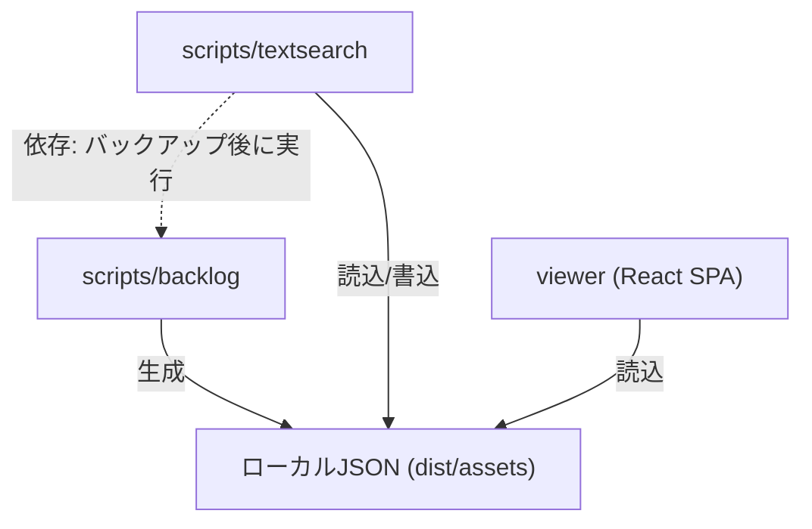

# Dependencies

## Internal Dependencies

### scripts/textsearch depends on scripts/backlog
- **Type**: Runtime (データ依存)
- **Reason**: バックアップスクリプトが生成したJSONデータを読み込んで検索インデックスを生成

### viewer depends on scripts/backlog
- **Type**: Runtime (データ依存)
- **Reason**: バックアップスクリプトが生成したJSONデータをViteのpublicDirとして配信

## External Dependencies

### Production Dependencies

#### backlog-js (v0.13.0)
- **Purpose**: Backlog REST API クライアント
- **License**: MIT

#### react (v18.2.0) + react-dom (v18.2.0)
- **Purpose**: UIフレームワーク
- **License**: MIT

#### mobx (v6.9.0) + mobx-react-lite (v3.4.3)
- **Purpose**: リアクティブ状態管理
- **License**: MIT

#### @mui/material (v5.13.6) + @mui/icons-material (v5.11.16) + @mui/x-data-grid (v6.9.0)
- **Purpose**: Material Design UIコンポーネント
- **License**: MIT

#### react-router-dom (v6.14.0)
- **Purpose**: クライアントサイドルーティング
- **License**: MIT

#### react-markdown (v8.0.7) + remark-gfm (v3.0.1)
- **Purpose**: Markdown描画
- **License**: MIT

#### react-syntax-highlighter (v15.5.0)
- **Purpose**: コードブロックのシンタックスハイライト
- **License**: MIT

#### flexsearch (v0.7.21)
- **Purpose**: クライアントサイド全文検索
- **License**: Apache-2.0

#### kuromojin (v3.0.0)
- **Purpose**: 日本語形態素解析
- **License**: MIT

#### dayjs (v1.11.8)
- **Purpose**: 日付フォーマット・操作
- **License**: MIT

### Dev Dependencies

#### typescript (v5.1.5)
- **Purpose**: TypeScriptコンパイラ
- **License**: Apache-2.0

#### vite (v4.3.9)
- **Purpose**: ビルドツール・開発サーバー
- **License**: MIT

#### rome (v12.1.3)
- **Purpose**: リンター/フォーマッター
- **License**: MIT
